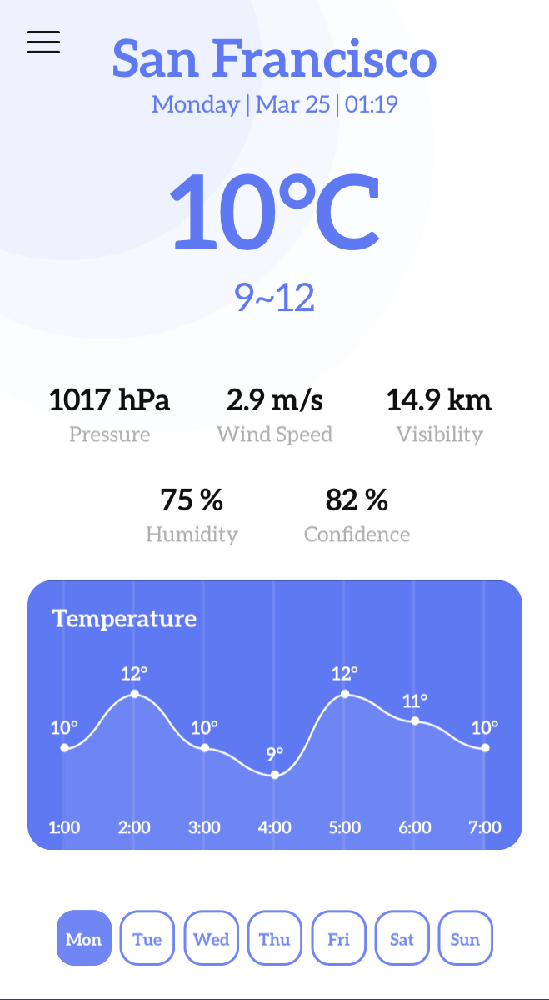
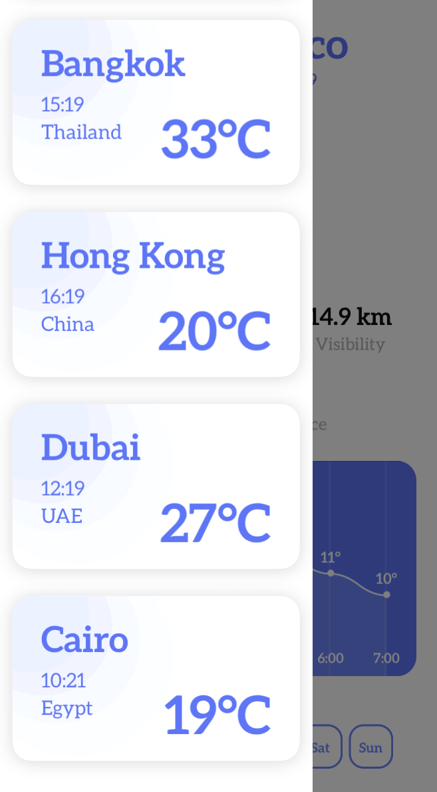

# Mohamed Salah WWDC19-Scholarship-Submission[Accepted]
Weather Prediction Using CoreML Playground.  
This playground can predict weather in 5 cities around the world at any date without any internet access.

Frameworks Used:
CreateML
CoreML
CoreGraphics
UIKit

[Demo Video on Youtube](https://www.youtube.com/watch?v=bH9FwLSS1LA&list=PLRg_ppvslSwr6rucF7IDsiW8nNE2zzJ76)
